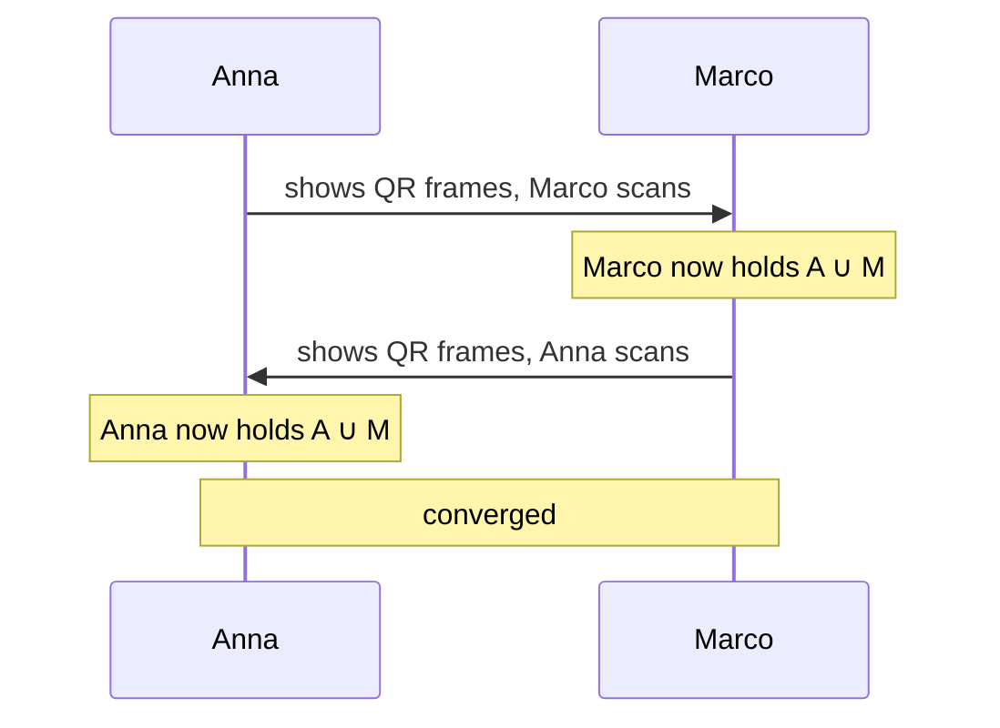

# Group Money Counter

A shared expense ledger for trips and flatmates — who paid for dinner, who owes whom, and
the shortest way to settle up.

It runs entirely on your phone. No account, no server, no network. Phones catch up with each
other by **showing QR codes across a table**.

**[Try it →](https://pippodima.github.io/group-money-counter/)** · Add it to your home screen
and it works offline forever.

---

## Why

Tricount and Splitwise are good apps that happen to hold your bank-adjacent social graph on
someone else's computer. This one keeps it on yours, and the interesting part is what falls
out of that constraint: with no server to arbitrate, "who has the right numbers?" has to be
answered by the data structure instead.

## What it does

- **Split any way** — equally, by shares (a couple counts as two, a child as half), by
  percentage, or by exact amounts with a running *"€4.20 left to assign"*.
- **Several payers on one bill** — Anna put in €30, Marco €18, split it five ways.
- **Balances that always sum to zero**, in integer cents, with the leftover cent assigned
  deterministically so every phone agrees.
- **Settle up two ways** — fewest payments overall, or pay back the person who actually
  paid.
- **Multiple groups**, each with its own colour, derived from the group id so *everyone sees
  the same colour for the same trip*.
- **Sync by QR code** in person, or **send an invite file** through whatever app you already
  message with.
- **Export and import** plain JSON, because browser storage is not forever.

## The privacy claim, precisely

The app makes **no network requests of any kind**. No CDN, no fonts, no analytics, no error
reporting. It is a static bundle that talks to nothing.

That is checked mechanically on every build — [`scripts/check-offline.mjs`](scripts/check-offline.mjs)
fails CI if the compiled output contains an external URL or a network API. It has caught
real ones: Vite's module-preload polyfill, and Workbox reaching for its own runtime.

What this does **not** claim is that your data can never leave the phone. You can export a
file and send it to someone — that is the point of invites. `navigator.share` hands the file
to your operating system's share sheet, and you choose where it goes. The guarantee is that
*this app never sends anything on its own*.

## How syncing works

Every change is an immutable event in an append-only log, stamped with a
[hybrid logical clock](src/core/hlc.ts). State is a pure fold over that log, sorted by
clock.

Which makes merging two phones a **set union**. Not a merge algorithm — a union. It is
idempotent, commutative and associative, so you can sync in any direction, any number of
times, in any order, and it always converges.



The payload is the event log, deflated and split into ~800-byte frames rendered as
[base45](src/sync/base45.ts) in QR alphanumeric mode. A realistic two-week trip — 5 people,
120 expenses — comes to about 42 bytes per event, or 8 frames. The sender loops them
forever, so a missed frame simply comes round again; that removes all handshaking from the
protocol.

Both phones can be in airplane mode.

## Running it

```bash
npm install
npm run dev        # localhost:5173/group-money-counter/
```

```bash
npm test           # 230 tests
npm run build      # typecheck → build → offline check
npm run preview    # serve the built app, with the service worker live
```

Note the `/group-money-counter/` path — it is the GitHub Pages base, and the bare root will
404.

## How the code is arranged

| Path | What lives there |
|---|---|
| [`src/core/`](src/core) | The domain. Pure functions, no DOM, no storage, no clock |
| [`src/sync/`](src/sync) | QR codec: framing, base45, encode and decode |
| [`src/store/`](src/store) | The live ledger — events on disk, folded state in memory |
| [`src/screens/`](src/screens) | Screens |
| [`src/lib/`](src/lib) | Money parsing, dates, colour, invites, routing |
| [`src/db/`](src/db) | IndexedDB |

### Two rules the build enforces

**`src/core/` must be pure.** No `Date.now()`, no randomness, no locale, no storage, no
imports from outside itself. If two phones fold the same events into different state,
balances drift apart and *nothing tells you*. So it is not a convention —
[`purity.test.ts`](src/core/purity.test.ts) scans the source and fails the build.

**Money is integer cents,** and ties break on replicated keys. €10 split three ways is
3.34 / 3.33 / 3.33, and the same person gets the extra cent on every device.

Most of the test suite is property-based rather than example-based, because the bugs that
matter here are the ones that only appear for particular numbers. `fold(shuffle(events))`
must equal `fold(events)`; balances must sum to zero; applying a settlement plan must clear
every balance. That found a real one-cent divergence in multi-payer settle-up within minutes
of being written.

## Status

Usable today for a real trip, single-device or synced. QR sync works end to end in tests but
has not yet been through a proper two-phone field test in bad light.

Not there yet: duplicate detection for when two people enter the same dinner, and
multi-currency. See [ROADMAP.md](ROADMAP.md).

## Documents

- **[DESIGN.md](DESIGN.md)** — the spec. Data model, merge semantics, split arithmetic, the
  sync protocol.
- **[ROADMAP.md](ROADMAP.md)** — milestones, with what is done and what is not.
- **[DIARY.md](DIARY.md)** — the development log. Every decision with its reasoning, every
  approach that was tried and abandoned, and the bugs worth remembering. Includes the ones
  where the spec turned out to be wrong: CBOR losing to plain JSON after deflate, and a hash
  that handed 44% of all groups the same colour.

## Licence

[MIT](LICENSE).
